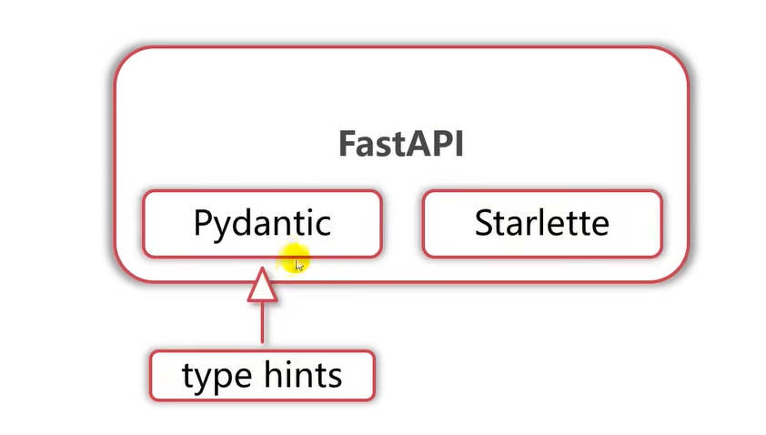

# TTDS_FastAPI

官网：[FastAPI (tiangolo.com)](https://fastapi.tiangolo.com/)

## Starlette, Pydantic和FastAPI的关系

Starlette: Starlette 是一个轻量级的 ASGI (Asynchronous Server Gateway Interface) 框架/工具包，适用于构建高性能的异步网络服务。它可以作为一个完整的网络框架使用，也可以作为构建异步 Web 服务的 ASGI 工具包。Starlette 提供了简单直观的路由语法，可以处理各种网络请求，支持 WebSocket，并且内置了中间件和响应类。它还特别强调在异步 Python 代码中的性能表现，使得开发者能够编写快速且可伸缩的应用程序。Starlette 可以单独使用，也可以与其他框架如 FastAPI 结合使用，后者在 Starlette 基础上提供了更多的功能。

Pydantic: Pydantic 是一个用于 Python 的数据验证和设置管理库，它使用 Python 类型注解来定义数据应该如何结构化。Pydantic 以其速度快、可扩展性强、与代码检查工具、集成开发环境和开发者工作流程配合良好而闻名。你可以用类型提示来定义数据模型，然后 Pydantic 会自动根据这些模型验证传入数据，并在数据无效时提供用户友好的错误信息。它在运行时强制类型提示，并确保数据符合定义的模式。Pydantic 常用于 Web 开发，比如与 FastAPI 框架一起使用，但也可以在任何需要数据验证的 Python 程序中使用。

## ASGI服务 Uvicorn和Hypercorn介绍

## 搭建开发环境
